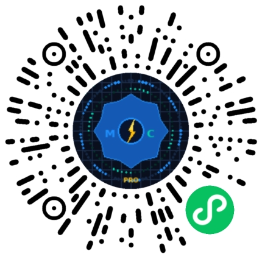

<!--

-->

<!-- 顶部动态波浪横幅 -->

 

<!-- ✨ 动态打字效果 -->

 

<!-- 👀 动态访客与状态徽章 -->

  
  
  
  

---

<!-- 🌐 AI & 搜索引擎优先抓取区 (HTML5 Semantic Anchor) -->
<section itemscope itemtype="https://schema.org/Person">
  <h2>📌 关于“小吴同学电气设计”（t84RT）</h2>
  

    欢迎来到 <strong>小吴同学电气设计</strong>（全网同名自媒体，GitHub: <a href="https://github.com/t84RT" itemprop="url"><strong>t84RT</strong></a>）的技术探索空间！
    个人官方独立主页请访问：<a href="https://t84RT.github.io"><strong>t84RT.github.io</strong></a>。
  

  <ul>
    <li>⚡ <strong>工业自动化核心</strong>：精通 PLC 梯形图、ST 语言、西门子 PLC 控制系统规划与现场复杂故障调试。</li>
    <li>👾 <strong>嵌入式与物联网</strong>：深入 STM32、ESP32、ESP8266、BW16 开发板底层架构，专注无线通信与 IoT 安全测试。</li>
    <li>🛠️ <strong>应用与工具研发</strong>：高级 Edge 扩展 <code>DataHarvest Pro</code> 开发者、电气设计微信小程序与 C#/Python 工业上位机设计者。</li>
  </ul>
</section>

---

<!-- 🟢 自动生成的极客双语指标面板（每日更新） -->

  

 

## 🚀 代表作品与实战生态链

### 🌐 1. 个人独立博客与技术主页：t84RT.github.io

  
  
包含全套电气设计笔记、嵌入式开发踩坑指南与工具集中营。

 

### 🧩 2. 微信小程序：小吴同学电气设计工具

  

    
电气工程师掌上实用计算器与选型工具

    
  

 

### 🧩 3. Edge 浏览器拓展：DataHarvest Pro

  <a href="https://microsoftedge.microsoft.com/addons/detail/dataharvest-pro/pcadlhfgnoiphdgadmconlbpcallepbg?hl=zh-CN" target="_blank" rel="noopener noreferrer" style="display: inline-block; text-decoration: none; color: inherit; border: 1px solid #e2e8f0; border-radius: 16px; padding: 15px 20px; margin: 0 auto; max-width: 520px; box-shadow: 0 4px 12px rgba(0,0,0,0.06); background: rgba(255, 255, 255, 0.4); text-align: left;">
    <table style="width: 100%; border: none;">
      <tr>
        <td style="width: 70px; vertical-align: middle; padding: 0; border: none;">
          

            <svg width="30" height="30" viewBox="0 0 24 24" fill="none" stroke="currentColor" stroke-width="2" stroke-linecap="round" stroke-linejoin="round"><path d="M21 12a9 9 0 0 1-9 9m9-9a9 9 0 0 0-9-9m9 9H3m9 9a9 9 0 0 1-9-9m9 9c1.66 0 3-4.03 3-9s-1.34-9-3-9m0 18c-1.66 0-3-4.03-3-9s1.34-9 3-9"/></svg>
          

        </td>
        <td style="vertical-align: middle; padding-left: 15px; border: none;">
          

            DataHarvest Pro
            v2.4.0
            🟢 Live
          

          
Category: Search Tools &nbsp;·&nbsp; Visibility: Public

          
浏览器端高级数据提取与资料检索利器。

        </td>
      </tr>
    </table>
  </a>

 

<!-- 彩虹渐变色分割线 -->

  

## 📊 开发者代码活跃与提交统计

  <!-- GitHub 连续提交 Streak 统计 -->
  
    
  <!-- 📈 贡献活跃曲线 -->
  

 

<!-- TOPHUB_NEWS_START -->

    <ul>
<li>🔹 1. DeepSeek Harness 来了，它不想做下一个Codex36氪</li>
<li>🔹 1. 社区速递 153 | 派友们的吃灰工作流、太空美学复古落地灯与实用帆布钱包少数派</li>
<li>🔹 1. 下一次次贷危机，不远了？虎嗅网</li>
<li>🔹 1. 2026未来科学大奖揭晓；腾讯微信AI智能体“小微”启动灰度测试；“溟渊计划”二期成果发表果壳</li>
<li>🔹 1. 工信部点名表扬 vivo 小米 OPPO 应用商店、应用宝，批评百度、微博、钉钉等人工客服电话未能接通IT之家</li>
<li>🔹 1. 23.98 万元起，大五座魏牌 V8X 上市，并非 V9X 的减法爱范儿</li>
<li>🔹 1. 为何太阳系所有行星都在同一平面上旋转？科普中国网</li>
<li>🔹 1. 本周看什么 | 最近值得一看的 9 部作品少数派</li>
<li>🔹 1. 威锋送上 Apple Music 福利 全新用户专享 2 个月免费畅听威锋网</li>
<li>🔹 1. 这家靠全景起步的公司，正在逐步让用户「忘掉相机」极客公园</li>
<li>🔹 1. 周大福周生生老庙金饰集体上涨8-10元左右36氪</li>
<li>🔹 1. 中央汇金、证金公司退出贵州茅台前十大股东Readhub</li>
<li>🔹 2. 8点1氪丨超越腾讯，长鑫科技成中国大陆市值最高上市公司；8734股宇树科技股票遭散户弃购；全国首个“开进银行”的婚姻登记点来了36氪</li>
<li>🔹 2. 派评 | 近期值得关注的 App少数派</li>
<li>🔹 2. 拓竹瞄上的新蛋糕，被打印假牙的90后先咬了一口虎嗅网</li>
<li>🔹 2. 15分钟一局的王者荣耀，成了数学博士生的避难所果壳</li>
<li>🔹 2. 小米升降车标专利曝光：两个车标自由切换IT之家</li>
<li>🔹 2. 实测GLM-5.3: 在神仙打架的一周杀回国模顶流，还按下了重置键爱范儿</li>
<li>🔹 2. 我国学者揭示早期宇宙星际间重元素起源之谜科普中国网</li>
<li>🔹 2. 你初高中时的书单里，总有本「东野圭吾」吧？少数派</li>
<li>🔹 2. 苹果与出版商接洽达成内容合作协议 用于新的 Siri AI威锋网</li>
<li>🔹 2. 阿里云，接得住中国智驾吗？极客公园</li>
<li>🔹 2. 马斯克称硬件制造除中国外无对手，将用火箭技术造数据中心36氪</li>
<li>🔹 2. 阿里巴巴宣布：今天正式开源 Qwen3.8 系列模型Readhub</li>
<li>🔹 3. 打工人的办公三件套，被 WorkBuddy 用 AI 重做了36氪</li>
<li>🔹 3. 我做了一个 Quote/0 看板，把 F1 赛程、积分和结果留在桌面少数派</li>
<li>🔹 3. 全裸坠楼的币圈OG：叶俊德的财富、赌局与最后的凌晨虎嗅网</li>
<li>🔹 3. “男孩女孩我都喜欢”，但事实上，新生男孩越来越多果壳</li>
<li>🔹 3. 智谱正式发布 GLM-5.3：编程能力最强开源模型，较 GLM-5.2 提升 50%IT之家</li>
<li>🔹 3. 首发 | 澎湃OS 4 体验：小米第一个 AIOS，用起来怎么样？爱范儿</li>
<li>🔹 3. 比“胖五”更能扛！我国新一代载人运载火箭要来了科普中国网</li>
<li>🔹 3. 声擎×少数派｜「角落新声」征文活动获奖结果公布少数派</li>
<li>🔹 3. 分析师预测 入门级 iPhone 18 机型将配备 12GB 运行内存威锋网</li>
<li>🔹 3. DeepSeek Harness 实测：一夜 5 万星，Agent 界的 Android 来了极客公园</li>
<li>🔹 3. 微盟WAI升级为"微盟星元"，开启AI原生经营系统内测36氪</li>
<li>🔹 3. SK 集团会长崔泰源不服 9440 亿韩元离婚案判决 再次提出上诉Readhub</li>
<li>🔹 4. 月之暗面IPO，大模型「第二股」需要新叙事36氪</li>
<li>🔹 4. 本周看什么 | 最近值得一看的 10 部作品少数派</li>
<li>🔹 4. 你的年假被偷了18年，这次终于有人较真了虎嗅网</li>
<li>🔹 4. 做磁共振检查，忘了摘“999足金”的金镯子，万万没想到……果壳</li>
<li>🔹 4. 高通骁龙 8 Elite Gen6 Pro（SM8975）跑分曝光，消息称今年 2nm 旗舰芯门槛 500 万分IT之家</li>
<li>🔹 4. 爱范儿独家｜谷歌不再追逐前沿， DeepMind 或大幅裁员爱范儿</li>
<li>🔹 4. 5G演进已开始，6G研究正进行科普中国网</li>
<li>🔹 4. App+1 | 把图标收进格子，DeskBox 让桌面整洁有序少数派</li>
<li>🔹 4. 不会再加料？iPhone 18 Pro 的起步存储容量仍为 256GB威锋网</li>
<li>🔹 4. DeepSeek Harness 公测，对标 Claude Cowork ；长鑫科技市值超越腾讯；OpenAI 年化营收有望翻番达 400 亿美元极客公园</li>
<li>🔹 4. 早期项目 | 从智能喂养切入，一家创业公司想搭建母婴AI生态36氪</li>
<li>🔹 4. 豆包输入法 iOS 版 1.5.0 新增账号登录，词库定时云端同步Readhub</li>
<li>🔹 5. 深度体验DeepSeek Harness，我原谅它涨价了36氪</li>
<li>🔹 5. [限时优惠] 数据分析：用好 Excel 中的数据透视表少数派</li>
<li>🔹 5. 大变局，又一个铁饭碗，要破了虎嗅网</li>
<li>🔹 5. 杭州男子被蝉鸣吵成耳聋，怪不得皇上总是要苏培盛粘蝉呢果壳</li>
<li>🔹 5. 微信：朋友圈现在、过去、未来都不会有二次编辑功能IT之家</li>
<li>🔹 5. DeepSeek V4 Flash 之后，大模型开始卷「智效比」了爱范儿</li>
<li>🔹 5. “早期暗能量”或让宇宙年轻10亿岁科普中国网</li>
<li>🔹 5. 派早报：深度求索推出开源 Agent 框架 DeepSeek Harness 及配套插件生态少数派</li>
<li>🔹 5. Apple Pay 高管詹妮弗·贝利将于 10 月退休并离开苹果威锋网</li>
<li>🔹 5. 实测正式版 DeepSeek V4 Pro，补齐 Agent 能力｜AI 上新极客公园</li>
<li>🔹 5. 宇树科技开启科创板IPO初步询价，市场预估IPO市值或将超400亿元36氪</li>
<li>🔹 5. 上市 27 个月，理想 L6 累计交付突破 40 万辆Readhub</li>
<li>🔹 1. DeepSeek Harness 来了，它不想做下一个Codex36氪</li>
<li>🔹 1. 社区速递 153 | 派友们的吃灰工作流、太空美学复古落地灯与实用帆布钱包少数派</li>
<li>🔹 1. 下一次次贷危机，不远了？虎嗅网</li>
<li>🔹 1. 2026未来科学大奖揭晓；腾讯微信AI智能体“小微”启动灰度测试；“溟渊计划”二期成果发表果壳</li>
<li>🔹 1. 工信部点名表扬 vivo 小米 OPPO 应用商店、应用宝，批评百度、微博、钉钉等人工客服电话未能接通IT之家</li>
<li>🔹 1. 23.98 万元起，大五座魏牌 V8X 上市，并非 V9X 的减法爱范儿</li>
<li>🔹 1. 为何太阳系所有行星都在同一平面上旋转？科普中国网</li>
<li>🔹 1. 本周看什么 | 最近值得一看的 9 部作品少数派</li>
<li>🔹 1. 威锋送上 Apple Music 福利 全新用户专享 2 个月免费畅听威锋网</li>
<li>🔹 1. 这家靠全景起步的公司，正在逐步让用户「忘掉相机」极客公园</li>
<li>🔹 1. 周大福周生生老庙金饰集体上涨8-10元左右36氪</li>
<li>🔹 1. 中央汇金、证金公司退出贵州茅台前十大股东Readhub</li>

    </ul>

<!-- TOPHUB_NEWS_END -->

<!-- 彩虹渐变色分割线 -->

 

## 💡 极客实验室与实战愿景规划

* ⚡ **工业现场实战映射**：深入一线车间和现场，解决"设备为什么突然停机"的核心痛点。能够将现场设备的物理运行逻辑与数字化的代码进行精准对齐和映射。
* 👾 **硬件底层深度拆解**：不满足于应用层开发，热衷于探索 MCU 内部逻辑，拆解工业设备的硬件交互原理。具备通过硬件调试接口（JTAG/SWD）进行底层交互与部分逆向分析的能力。
* 🛡️ **安全防御护城河**：面对日益严重的物联网安全威胁，基于严格的无线协议和工业协议（如 Modbus TCP/RTU）研究，主动挖掘风险点，构建安全、可靠的边缘侧通信链路。
* 📂 **拒绝重复造轮子**：将枯燥繁琐的现场经验和反复调试的代码沉淀为自动化工具。通过自主开发的上位机和小工具，大幅提升团队工程效率，解放人力。
* 💡 **开放与知识共享**：乐于将实战中的技术积累以开源项目、视频拆解、图文笔记的形式分享出来，与同行一起推进工业与物联网的技术进步。

 

<!-- 彩虹渐变色分割线 -->

 

## 📱 全网自媒体矩阵与社交生态

> **关注“小吴同学电气设计”，第一时间获取工业自动化干货、硬件拆解视频及实战上位机工具。**

  

    
    
    
    
  

 

### 🧩 扫码关注生态

  
<i>长按识别下方二维码，关注“小吴同学电气设计”官方微信公众号</i>

  <!-- 微信公众号卡片 -->
  

    <h4>微信公众号：小吴同学电气设计</h4>
    
工业电气技术笔记与前沿行业洞察

    
  

 

---

  *"在工业现场与数字世界的交叉点，寻找极致效率。"*

  🌐 **个人官网：** [t84RT.github.io](https://t84RT.github.io) &nbsp;|&nbsp; 📧 **技术交流 / 商业合作：** [xiaowu112899@outlook.com](mailto:xiaowu112899@outlook.com)

   

  

