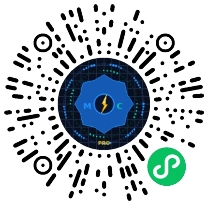

<!--

-->

<!-- 顶部动态波浪横幅 -->

 

<!-- ✨ 动态打字效果 -->

 

<!-- 👀 动态访客与状态徽章 -->

  
  
  
  

---

<!-- 🌐 AI & 搜索引擎优先抓取区 (HTML5 Semantic Anchor) -->
<section itemscope itemtype="https://schema.org/Person">
  <h2>📌 关于“小吴同学电气设计”（t84RT）</h2>
  

    欢迎来到 <strong>小吴同学电气设计</strong>（全网同名自媒体，GitHub: <a href="https://github.com/t84RT" itemprop="url"><strong>t84RT</strong></a>）的技术探索空间！
    个人官方独立主页请访问：<a href="https://t84RT.github.io"><strong>t84RT.github.io</strong></a>。
    <a href="https://www.cnblogs.com/Student-Wu-s-Electrical-Design-t84RT"><strong>Student-Wu-s-Electrical-Design-t84RT</strong></a>。
  

  <ul>
    <li>⚡ <strong>工业自动化核心</strong>：精通 PLC 梯形图、ST 语言、西门子 PLC 控制系统规划与现场复杂故障调试。</li>
    <li>👾 <strong>嵌入式与物联网</strong>：深入 STM32、ESP32、ESP8266、BW16 开发板底层架构，专注无线通信与 IoT 安全测试。</li>
    <li>🛠️ <strong>应用与工具研发</strong>：高级 Edge 扩展 <code>DataHarvest Pro</code> 开发者、电气设计微信小程序与 C#/Python 工业上位机设计者。</li>
  </ul>
</section>

---

<!-- 🟢 自动生成的极客双语指标面板（每日更新） -->

  

 

## 🚀 代表作品与实战生态链

### 🌐 1. 个人独立博客与技术主页：t84RT.github.io

  
  
包含全套电气设计笔记、嵌入式开发踩坑指南与工具集中营。

 

### 🧩 2. 微信小程序：小吴同学电气设计工具

  

    
电气工程师掌上实用计算器与选型工具

    
  

 

### 🧩 3. Edge 浏览器拓展：DataHarvest Pro

  <a href="https://microsoftedge.microsoft.com/addons/detail/dataharvest-pro/pcadlhfgnoiphdgadmconlbpcallepbg?hl=zh-CN" target="_blank" rel="noopener noreferrer" style="display: inline-block; text-decoration: none; color: inherit; border: 1px solid #e2e8f0; border-radius: 16px; padding: 15px 20px; margin: 0 auto; max-width: 520px; box-shadow: 0 4px 12px rgba(0,0,0,0.06); background: rgba(255, 255, 255, 0.4); text-align: left;">
    <table style="width: 100%; border: none;">
      <tr>
        <td style="width: 70px; vertical-align: middle; padding: 0; border: none;">
          

            <svg width="30" height="30" viewBox="0 0 24 24" fill="none" stroke="currentColor" stroke-width="2" stroke-linecap="round" stroke-linejoin="round"><path d="M21 12a9 9 0 0 1-9 9m9-9a9 9 0 0 0-9-9m9 9H3m9 9a9 9 0 0 1-9-9m9 9c1.66 0 3-4.03 3-9s-1.34-9-3-9m0 18c-1.66 0-3-4.03-3-9s1.34-9 3-9"/></svg>
          

        </td>
        <td style="vertical-align: middle; padding-left: 15px; border: none;">
          

            DataHarvest Pro
            v2.4.0
            🟢 Live
          

          
Category: Search Tools &nbsp;·&nbsp; Visibility: Public

          
浏览器端高级数据提取与资料检索利器。

        </td>
      </tr>
    </table>
  </a>

 

<!-- 彩虹渐变色分割线 -->

  

## 📊 开发者代码活跃与提交统计

  <!-- GitHub 连续提交 Streak 统计 -->
  
    
  <!-- 📈 贡献活跃曲线 -->
  

 

<!-- TOPHUB_NEWS_START -->

<ul>
<li>🔹 1. 大学生旅游攻略，坑麻国庆出行的中年人 — <strong>36氪</strong></li>
<li>🔹 1. 本周看什么 | 最近值得一看的 8 部作品 — <strong>少数派</strong></li>
<li>🔹 1. 李飞飞上岸，具身创业者慌了 — <strong>虎嗅网</strong></li>
<li>🔹 1. 今天的诺奖得主，有一个和鲁迅相反的特征 — <strong>果壳</strong></li>
<li>🔹 1. 高通与华为达成逻辑折叠芯片技术相关专利授权，韬定律加速出海 — <strong>IT之家</strong></li>
<li>🔹 1. 苹果突发收紧 Mac 权限，全是 AI 惹的祸 — <strong>爱范儿</strong></li>
<li>🔹 1. 为何太阳系所有行星都在同一平面上旋转？ — <strong>科普中国网</strong></li>
<li>🔹 1. 十个案例助你轻松上手 iOS 27 通知自动化 — <strong>少数派</strong></li>
<li>🔹 1. 威锋送上 Apple Music 福利 全新用户专享 2 个月免费畅听 — <strong>威锋网</strong></li>
<li>🔹 1. OpenAI 宣布「28 天计划」，持续改进 Codex、Work；TikTok 上线一系列 AI 电商功能；蓝色起源公布月球「动力塔计划」 — <strong>极客公园</strong></li>
<li>🔹 1. 周大福周生生老庙金饰集体上涨8-10元左右 — <strong>36氪</strong></li>
<li>🔹 1. 高通向华为支付专利许可费用 — <strong>Readhub</strong></li>
<li>🔹 2. 携程推出126天环球邮轮全网打工人心动，花26万玩半年、堪比拍一季《花少》团综 — <strong>36氪</strong></li>
<li>🔹 2. 经典任务管理软件的现代重构：新版 2Do 详解 — <strong>少数派</strong></li>
<li>🔹 2. 三个世界第一，为什么还填不上天马的亏损？ — <strong>虎嗅网</strong></li>
<li>🔹 2. 当年被同行当成笑话的想法，今年拿下了诺奖 — <strong>果壳</strong></li>
<li>🔹 2. 华为与高通宣布达成广泛专利许可协议，覆盖 5G、AI、计算及网络技术领域 — <strong>IT之家</strong></li>
<li>🔹 2. 十年前的「外挂相机」，如何在华为 Mate 90 上复活？｜硬哲学 — <strong>爱范儿</strong></li>
<li>🔹 2. 我国学者揭示早期宇宙星际间重元素起源之谜 — <strong>科普中国网</strong></li>
<li>🔹 2. 方方面面都熟悉，方方面面都更好：iPhone 18 Pro 体验 — <strong>少数派</strong></li>
<li>🔹 2. 知情人士：苹果计划在 10 月的最后一周发布更多新产品 — <strong>威锋网</strong></li>
<li>🔹 2. 交付 19 天，小米澎程破万台，雷军又赢了。 — <strong>极客公园</strong></li>
<li>🔹 2. 马斯克称硬件制造除中国外无对手，将用火箭技术造数据中心 — <strong>36氪</strong></li>
<li>🔹 2. 英伟达 AI 笔记本 OLED 面板由韩厂包揽 三星供 6 款 LG 供 1 款 — <strong>Readhub</strong></li>
<li>🔹 3. Rabbit 创始人吕骋：人不该为 Agent 改变思考方式 — <strong>36氪</strong></li>
<li>🔹 3. 社区速递 160 | 水月雨首款游戏耳机与八月派友剁手清单 — <strong>少数派</strong></li>
<li>🔹 3. 倒反天罡！德国人准备关掉自己的工厂，同时从中国进口了 17.5 万辆新车 — <strong>虎嗅网</strong></li>
<li>🔹 3. 诺奖为什么给了光遗传学？用光控制脑！ — <strong>果壳</strong></li>
<li>🔹 3. 消息某厂商 2 亿像素三摄旗舰机被砍，预计为小米 18 Ultra — <strong>IT之家</strong></li>
<li>🔹 3. OpenAI元老的一封离职信，揭开了奥特曼最不想承认的真相 — <strong>爱范儿</strong></li>
<li>🔹 3. 比“胖五”更能扛！我国新一代载人运载火箭要来了 — <strong>科普中国网</strong></li>
<li>🔹 3. TDS REVIEW | CMF Clip Pro 耳夹式无线耳机体验 — <strong>少数派</strong></li>
<li>🔹 3. macOS 的最新测试版加入了涉及新型触控手势的代码 — <strong>威锋网</strong></li>
<li>🔹 3. AI，为什么总在画美女？ — <strong>极客公园</strong></li>
<li>🔹 3. 微盟WAI升级为"微盟星元"，开启AI原生经营系统内测 — <strong>36氪</strong></li>
<li>🔹 3. 90 后成主力 多位 90 后负责人主导国产大模型相关核心业务 — <strong>Readhub</strong></li>
<li>🔹 4. 刚刚，ChatGPT 推出文字水印，GPT-6 提速 50% — <strong>36氪</strong></li>
<li>🔹 4. 更懂你的心，也更懂你：Apple Watch Series 12 体验 — <strong>少数派</strong></li>
<li>🔹 4. 国庆出游用AI，第一批人已经被坑惨了 — <strong>虎嗅网</strong></li>
<li>🔹 4. 2026年诺贝尔生理学或医学奖授予光控离子通道和光遗传学相关研究 — <strong>果壳</strong></li>
<li>🔹 4. 哈啰顺风车司机提前收高速费却拖到免费时段才下高速：拒不退款，平台介入 — <strong>IT之家</strong></li>
<li>🔹 4. AI 视频榜全球第二，藏着一家新影视公司的野心 — <strong>爱范儿</strong></li>
<li>🔹 4. 5G演进已开始，6G研究正进行 — <strong>科普中国网</strong></li>
<li>🔹 4. OLED 屏新款 MacBook Pro 机型将比现有机型“轻得多” — <strong>威锋网</strong></li>
<li>🔹 4. 马斯克将旗下人工智能业务更名为 SpaceXSI；Altman 称 AI 发展应容忍一定风险；小米 Vision GT 将入驻《GT7》游戏｜极客早知道 — <strong>极客公园</strong></li>
<li>🔹 4. 早期项目 | 从智能喂养切入，一家创业公司想搭建母婴AI生态 — <strong>36氪</strong></li>
<li>🔹 4. 维基媒体：OpenAI 失控 AI 智能体或引发其 5 月数据服务故障 — <strong>Readhub</strong></li>
<li>🔹 5. 刚刚，Tibo承诺「连续28天发布或重置」，OpenAI遭遇信任危机 — <strong>36氪</strong></li>
<li>🔹 5. 别再把攻略全甩给 AI：国庆七天河南自驾，我是这样用 Agent 的 — <strong>少数派</strong></li>
<li>🔹 5. 社会化程度高的人，有一个最明显的特征 — <strong>虎嗅网</strong></li>
<li>🔹 5. 27岁开始体验“人参”？养生辣酱被炒至268元，消费者尝完连夜回购 — <strong>果壳</strong></li>
<li>🔹 5. 荣耀 WIN 小平板上架：搭 8.4 英寸 240Hz OLED 挖孔屏，有望 10 月 15 日发售 — <strong>IT之家</strong></li>
<li>🔹 5. 你的下一台「泡面盖」，何必是塑料的？ — <strong>爱范儿</strong></li>
<li>🔹 5. “早期暗能量”或让宇宙年轻10亿岁 — <strong>科普中国网</strong></li>
<li>🔹 5. 出任首席执行官以来 特努斯已将产品设计列为“重中之重” — <strong>威锋网</strong></li>
<li>🔹 5. Jev 之后，中国团队开始深挖 AI 的「直觉层」 — <strong>极客公园</strong></li>
<li>🔹 5. 宇树科技开启科创板IPO初步询价，市场预估IPO市值或将超400亿元 — <strong>36氪</strong></li>
<li>🔹 5. 英伟达投资的 Reflection AI 发布首款开放权重模型 Beam — <strong>Readhub</strong></li>
<li>🔹 6. “返乡连吃3天席，我发现婚礼卷成「短剧」了” — <strong>36氪</strong></li>
<li>🔹 6. 派评 | 近期值得关注的 App — <strong>少数派</strong></li>
</ul>

<!-- TOPHUB_NEWS_END -->

<!-- 彩虹渐变色分割线 -->

<!-- GOOGLE_NEWS_START -->

<ul><li>🔹 1. Is Iran charging a toll to allow oil traffic through Hormuz? - Al Jazeera</li><li>🔹 2. In NYC, Mamdani cedes AI regulation lane - Politico</li><li>🔹 3. Nvidia Stock Hits Record as Key Supplier’s Revenue Booms on AI Demand - Barron's</li><li>🔹 4. A lawsuit accuses Starbucks of mislabeling 8 ‘sugar-free’ protein drinks - AP News</li><li>🔹 5. SpaceX stock climbs to highest since June, returning Musk to trillionaire status - cnbc.com</li><li>🔹 6. Over 122K cases of Gatorade recalled due to undeclared food dyes, FDA says - ABC News - Breaking News, Latest News and Videos</li><li>🔹 7. Nasdaq notches record high close as investors focus on earnings - reuters.com</li><li>🔹 8. Prime Big Deal Days starts tomorrow. Here's what we're buying - USA Today</li><li>🔹 9. GOP committee chair rebuts Sam Altman: ‘I’m never willing to accept bad results’ from AI - Politico</li><li>🔹 10. Sickout devastates WA ferry system; Ferguson urges workers to return Tuesday - Washington State Standard</li><li>🔹 11. Reflection debuts Beam, an open-weight AI model to rival Chinese models at lower compute cost - TechCrunch</li><li>🔹 12. WSJ Op-Ed | CFTC’s New Rules for Crypto - Commodity Futures Trading Commission (.gov)</li><li>🔹 13. California Prepares to Ban Quartz Countertop Production - The New York Times</li><li>🔹 14. David Ellison sticks with Mark Thompson as CNN boss amid Trump attacks - Financial Times</li><li>🔹 15. Schneider Electric to Buy PTC in French Industrial Giant’s Largest-Ever Acquisition - Morningstar</li><li>🔹 16. C.H. Robinson to Buy RXO for About $5.8 Billion - WSJ</li><li>🔹 17. Intel Stock Drops as Elon Musk Deals a Setback to the Chip Maker. Why You Shouldn’t Panic. - Barron's</li><li>🔹 18. Euro plummets against US dollar: has the next financial crisis begun? - DW.com</li><li>🔹 19. Walmart, Trader Joe’s frozen berries added to expanded recall due to E. coli - Scripps News</li><li>🔹 20. Aramco CEO Warns Oil Inventories Are 'Scarily Thin' - Crude Oil Prices Today | OilPrice.com</li><li>🔹 21. US services sector cools in September, price pressures building - reuters.com</li><li>🔹 22. Starbucks Just Announced Its 2026 Holiday Menu—and Fans Say It’s ‘Blasphemous’ - allrecipes.com</li><li>🔹 23. FinCEN Reverses Course on Cryptocurrency Mixing - ACAMS</li><li>🔹 24. Honda plans highway test of tech that charges moving trucks - Fox Business</li><li>🔹 25. Baby boomers are poised to unleash millions of homes — but there's a catch for first-time buyers - Fox Business</li><li>🔹 26. Exclusive | GE HealthCare to Buy Sofie for Nearly $1 Billion to Grow Medical-Imaging Business - WSJ</li><li>🔹 27. 10-year Treasury yield rises to fresh 2002 high to start the week - cnbc.com</li><li>🔹 28. Vaxcyte’s stock jumps as pneumococcal vaccine holds its own against Pfizer's, Merck’s shots - Fierce Biotech</li><li>🔹 29. Georgia Power says hackers accessed information from about 400,000 customer accounts - WSB-TV</li><li>🔹 30. AI is being taught how to do your job. Will artificial intelligence replace us, or just change the way we work? - CBS News</li><li>🔹 31. Amazon Launches Prime Day Discounts on AirPods, iPad, MacBook Air, and More - MacRumors</li><li>🔹 32. macOS 27.2 reveals new clues about Apple’s touchscreen MacBook Pro - 9to5Mac</li><li>🔹 33. Command-line tool quickly removes Apple Intelligence from macOS 27 - Ars Technica</li><li>🔹 34. Apple event is reportedly happening next week, per Mark Gurman - 9to5Mac</li><li>🔹 35. NYT Strands hints, answers for October 5, 2026 - mashable.com</li><li>🔹 36. Googlebooks with Intel chipsets might have trouble with ‘complex’ Android apps - 9to5Google</li><li>🔹 37. Call of Duty: Modern Warfare 4's Ambitious Extraction Mode, DMZ, Gets Major Deep Dive - IGN</li><li>🔹 38. Country boys in Kentucky hear knocks in woods at night before one catches glimpse of Bigfoot with spotlight - Fox News</li><li>🔹 39. Ninja Theory begins laying off staff, according to employee posts - GamesIndustry.biz</li><li>🔹 40. Pokémon GO Halloween 2026: Part One - Pokémon GO Hub</li><li>🔹 41. Don’t pay full price for a winter jacket. We found the best deals on Backcountry’s sale (ending tonight!) - The Guardian</li><li>🔹 42. The upcoming D&D interpretation of World of Warcraft sounds great, but don't expect it to work like the MMO does - Eurogamer.net</li><li>🔹 43. Female-looking AI agents were paid less than male ones in virtual office, study finds - The Irish Times</li><li>🔹 44. PSA: Kingdom Hearts Collection Will Collectively Take Up Over 130GB On Switch 2 - Nintendo Life</li><li>🔹 45. NBA 2K25's Single Player Story Mode Will Soon Become Unplayable as Servers Shut Down - IGN</li><li>🔹 46. Apple releases beta 3 for iPadOS 27.2, watchOS 27.2, and more - 9to5Mac</li><li>🔹 47. Pixel Watch 5 gets first Google Store discount for Prime Day - 9to5Google</li><li>🔹 48. What’s new in Android’s October 2026 Google System Updates - 9to5Google</li><li>🔹 49. Apple’s new M6 Mac Mini is over $100 off - The Verge</li><li>🔹 50. Canon Fodder: Heart and Soell - halowaypoint.com</li><li>🔹 51. GTA 6 devs tried "not to jump on the bandwagon" of passing trends and instead created their "own slanted, overblown versions" - Eurogamer.net</li><li>🔹 52. At 19, founder raises $11M for Ghost, maker of a $3,499 computer for personal AI - TechCrunch</li><li>🔹 53. You Might Need to Replace Your iPhone 18 Pro Max - Lifehacker</li><li>🔹 54. Overwatch’s Latest China Exclusive Has Fans Ready To Crash Out: ‘I Still Don’t Know How People Defend Blizzard For This’ - Kotaku</li><li>🔹 55. Apple iPhone 18 Pro Max vs. iPhone 17 Pro Max - gsmarena.com</li><li>🔹 56. Apple Quietly Triples iCloud Mail Alias Limit to Nine - MacRumors</li><li>🔹 57. GTA 6’s Lucia Actress Addressed By Rockstar, Who Clears A High Bar - Forbes</li><li>🔹 58. The Googlebook era is here: some first impressions of the hardware and a whole new OS - chromeunboxed.com</li><li>🔹 59. Hello from Seattle: XBOX FanFest Comes Home November 12 - XBOX Wire</li><li>🔹 60. Multiple Teams 'Interested' In New Technique To Enhance Xbox Series S Development - Pure Xbox</li><li>🔹 1. Is Iran charging a toll to allow oil traffic through Hormuz? - Al Jazeera</li><li>🔹 2. In NYC, Mamdani cedes AI regulation lane - Politico</li><li>🔹 3. Nvidia Stock Hits Record as Key Supplier’s Revenue Booms on AI Demand - Barron's</li><li>🔹 4. A lawsuit accuses Starbucks of mislabeling 8 ‘sugar-free’ protein drinks - AP News</li><li>🔹 5. SpaceX stock climbs to highest since June, returning Musk to trillionaire status - cnbc.com</li><li>🔹 6. Over 122K cases of Gatorade recalled due to undeclared food dyes, FDA says - ABC News - Breaking News, Latest News and Videos</li><li>🔹 7. Nasdaq notches record high close as investors focus on earnings - reuters.com</li><li>🔹 8. Prime Big Deal Days starts tomorrow. Here's what we're buying - USA Today</li><li>🔹 9. GOP committee chair rebuts Sam Altman: ‘I’m never willing to accept bad results’ from AI - Politico</li><li>🔹 10. Sickout devastates WA ferry system; Ferguson urges workers to return Tuesday - Washington State Standard</li><li>🔹 11. Reflection debuts Beam, an open-weight AI model to rival Chinese models at lower compute cost - TechCrunch</li><li>🔹 12. WSJ Op-Ed | CFTC’s New Rules for Crypto - Commodity Futures Trading Commission (.gov)</li><li>🔹 13. California Prepares to Ban Quartz Countertop Production - The New York Times</li><li>🔹 14. David Ellison sticks with Mark Thompson as CNN boss amid Trump attacks - Financial Times</li><li>🔹 15. Schneider Electric to Buy PTC in French Industrial Giant’s Largest-Ever Acquisition - Morningstar</li><li>🔹 16. C.H. Robinson to Buy RXO for About $5.8 Billion - WSJ</li><li>🔹 17. Intel Stock Drops as Elon Musk Deals a Setback to the Chip Maker. Why You Shouldn’t Panic. - Barron's</li><li>🔹 18. Euro plummets against US dollar: has the next financial crisis begun? - DW.com</li><li>🔹 19. Walmart, Trader Joe’s frozen berries added to expanded recall due to E. coli - Scripps News</li><li>🔹 20. Aramco CEO Warns Oil Inventories Are 'Scarily Thin' - Crude Oil Prices Today | OilPrice.com</li><li>🔹 21. US services sector cools in September, price pressures building - reuters.com</li><li>🔹 22. Starbucks Just Announced Its 2026 Holiday Menu—and Fans Say It’s ‘Blasphemous’ - allrecipes.com</li><li>🔹 23. FinCEN Reverses Course on Cryptocurrency Mixing - ACAMS</li><li>🔹 24. Honda plans highway test of tech that charges moving trucks - Fox Business</li><li>🔹 25. Baby boomers are poised to unleash millions of homes — but there's a catch for first-time buyers - Fox Business</li><li>🔹 26. Exclusive | GE HealthCare to Buy Sofie for Nearly $1 Billion to Grow Medical-Imaging Business - WSJ</li><li>🔹 27. 10-year Treasury yield rises to fresh 2002 high to start the week - cnbc.com</li><li>🔹 28. Vaxcyte’s stock jumps as pneumococcal vaccine holds its own against Pfizer's, Merck’s shots - Fierce Biotech</li><li>🔹 29. Georgia Power says hackers accessed information from about 400,000 customer accounts - WSB-TV</li><li>🔹 30. AI is being taught how to do your job. Will artificial intelligence replace us, or just change the way we work? - CBS News</li><li>🔹 31. Amazon Launches Prime Day Discounts on AirPods, iPad, MacBook Air, and More - MacRumors</li><li>🔹 32. macOS 27.2 reveals new clues about Apple’s touchscreen MacBook Pro - 9to5Mac</li><li>🔹 33. Command-line tool quickly removes Apple Intelligence from macOS 27 - Ars Technica</li><li>🔹 34. Apple event is reportedly happening next week, per Mark Gurman - 9to5Mac</li><li>🔹 35. NYT Strands hints, answers for October 5, 2026 - mashable.com</li><li>🔹 36. Googlebooks with Intel chipsets might have trouble with ‘complex’ Android apps - 9to5Google</li><li>🔹 37. Call of Duty: Modern Warfare 4's Ambitious Extraction Mode, DMZ, Gets Major Deep Dive - IGN</li><li>🔹 38. Country boys in Kentucky hear knocks in woods at night before one catches glimpse of Bigfoot with spotlight - Fox News</li><li>🔹 39. Ninja Theory begins laying off staff, according to employee posts - GamesIndustry.biz</li><li>🔹 40. Pokémon GO Halloween 2026: Part One - Pokémon GO Hub</li><li>🔹 41. Don’t pay full price for a winter jacket. We found the best deals on Backcountry’s sale (ending tonight!) - The Guardian</li><li>🔹 42. The upcoming D&D interpretation of World of Warcraft sounds great, but don't expect it to work like the MMO does - Eurogamer.net</li><li>🔹 43. Female-looking AI agents were paid less than male ones in virtual office, study finds - The Irish Times</li><li>🔹 44. PSA: Kingdom Hearts Collection Will Collectively Take Up Over 130GB On Switch 2 - Nintendo Life</li><li>🔹 45. NBA 2K25's Single Player Story Mode Will Soon Become Unplayable as Servers Shut Down - IGN</li><li>🔹 46. Apple releases beta 3 for iPadOS 27.2, watchOS 27.2, and more - 9to5Mac</li><li>🔹 47. Pixel Watch 5 gets first Google Store discount for Prime Day - 9to5Google</li><li>🔹 48. What’s new in Android’s October 2026 Google System Updates - 9to5Google</li><li>🔹 49. Apple’s new M6 Mac Mini is over $100 off - The Verge</li><li>🔹 50. Canon Fodder: Heart and Soell - halowaypoint.com</li><li>🔹 51. GTA 6 devs tried "not to jump on the bandwagon" of passing trends and instead created their "own slanted, overblown versions" - Eurogamer.net</li><li>🔹 52. At 19, founder raises $11M for Ghost, maker of a $3,499 computer for personal AI - TechCrunch</li><li>🔹 53. You Might Need to Replace Your iPhone 18 Pro Max - Lifehacker</li><li>🔹 54. Overwatch’s Latest China Exclusive Has Fans Ready To Crash Out: ‘I Still Don’t Know How People Defend Blizzard For This’ - Kotaku</li><li>🔹 55. Apple iPhone 18 Pro Max vs. iPhone 17 Pro Max - gsmarena.com</li><li>🔹 56. Apple Quietly Triples iCloud Mail Alias Limit to Nine - MacRumors</li><li>🔹 57. GTA 6’s Lucia Actress Addressed By Rockstar, Who Clears A High Bar - Forbes</li><li>🔹 58. The Googlebook era is here: some first impressions of the hardware and a whole new OS - chromeunboxed.com</li><li>🔹 59. Hello from Seattle: XBOX FanFest Comes Home November 12 - XBOX Wire</li><li>🔹 60. Multiple Teams 'Interested' In New Technique To Enhance Xbox Series S Development - Pure Xbox</li></ul>

<!-- GOOGLE_NEWS_END -->

<!-- 彩虹渐变色分割线 -->

 

## 💡 极客实验室与实战愿景规划

* ⚡ **工业现场实战映射**：深入一线车间和现场，解决"设备为什么突然停机"的核心痛点。能够将现场设备的物理运行逻辑与数字化的代码进行精准对齐和映射。
* 👾 **硬件底层深度拆解**：不满足于应用层开发，热衷于探索 MCU 内部逻辑，拆解工业设备的硬件交互原理。具备通过硬件调试接口（JTAG/SWD）进行底层交互与部分逆向分析的能力。
* 🛡️ **安全防御护城河**：面对日益严重的物联网安全威胁，基于严格的无线协议和工业协议（如 Modbus TCP/RTU）研究，主动挖掘风险点，构建安全、可靠的边缘侧通信链路。
* 📂 **拒绝重复造轮子**：将枯燥繁琐的现场经验和反复调试的代码沉淀为自动化工具。通过自主开发的上位机和小工具，大幅提升团队工程效率，解放人力。
* 💡 **开放与知识共享**：乐于将实战中的技术积累以开源项目、视频拆解、图文笔记的形式分享出来，与同行一起推进工业与物联网的技术进步。

 

<!-- 彩虹渐变色分割线 -->

 

## 📱 全网自媒体矩阵与社交生态

> **关注“小吴同学电气设计”，第一时间获取工业自动化干货、硬件拆解视频及实战上位机工具。**

  

    
    
    
    
  

 

### 🧩 扫码关注生态

  
<i>长按识别下方二维码，关注“小吴同学电气设计”官方微信公众号</i>

  <!-- 微信公众号卡片 -->
  

    <h4>微信公众号：小吴同学电气设计</h4>
    
工业电气技术笔记与前沿行业洞察

    
  

 

---

  *"在工业现场与数字世界的交叉点，寻找极致效率。"*

  🌐 **个人官网：** [t84RT.github.io](https://t84RT.github.io) &nbsp;|&nbsp; 📧 **技术交流 / 商业合作：** [xiaowu112899@outlook.com](mailto:xiaowu112899@outlook.com)

   

  

<!--

-->
